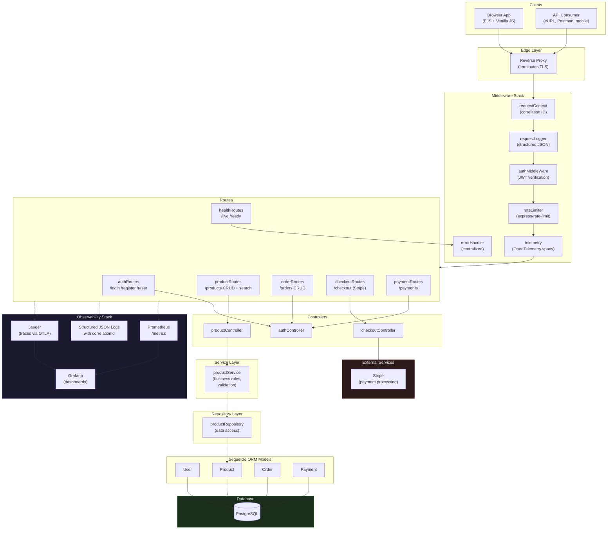

# E-Commerce Backend API (Production-Ready Portfolio Project)


A backend-focused e-commerce API that demonstrates more than CRUD: it is structured to showcase **operational excellence**, including **monitoring, observability, reliability patterns, secure defaults, and production-aware architecture**.

## Why this project stands out for backend roles

This repository is intentionally designed as a **backend developer portfolio project** with focus on:

- API design and business logic boundaries
- maintainable architecture (routes → controllers → services → repositories)
- robust error handling and validation
- JWT auth and rate-limited login endpoint
- production-grade telemetry (metrics + tracing + structured logging)
- health checks and graceful shutdown behavior
- containerized runtime and CI-ready workflow

## Architecture



**Legend:** Solid lines = request flow. Dashed lines = observability data flow. Dotted layers = not yet extracted (Orders/Payments/Auth still use inline logic).

Detailed architecture notes: `docs/ARCHITECTURE.md`. Pending improvements tracked in `docs/PENDING_IMPROVEMENTS.md`.

## Tech stack

- **Runtime:** Node.js 20, Express 4
- **Database:** PostgreSQL + Sequelize ORM
- **Auth/Security:** JWT, bcrypt, express-rate-limit
- **Observability:** Prometheus, Grafana, OpenTelemetry, Jaeger
- **Docs:** Swagger UI (`/api-docs`)
- **Testing:** Jest + Supertest
- **Containerization:** Docker + Docker Compose
- **CI:** GitHub Actions workflow

## API overview

Base URL: `http://localhost:5004`

Core domains:
- `POST /api/auth/register`, `POST /api/auth/login`, `GET /api/auth/profile`
- `GET/POST/PUT/DELETE /api/products`
- `GET/POST /api` (orders)
- `POST /api/checkout`
- `POST /api/payments`

Operational endpoints:
- `GET /health/live` – process heartbeat
- `GET /health/ready` – dependency readiness (DB connectivity)
- `GET /metrics` – Prometheus scrape endpoint
- `GET /api-docs` – interactive API docs

## Monitoring and observability

### 1) Structured logging
Each request is logged as JSON with:
- timestamp
- level
- method/path/status
- duration
- `correlationId`

### 2) Correlation IDs
`x-correlation-id` is accepted or generated per request and returned in responses. This allows tracing a single request across logs, metrics labels, and traces.

### 3) Metrics (Prometheus)
Available on `/metrics`:
- `http_request_duration_seconds` (histogram)
- `http_requests_total` (counter)
- `http_in_flight_requests` (gauge)
- `api_errors_total` (counter)
- default Node.js process/runtime metrics

### 4) Tracing (OpenTelemetry)
OpenTelemetry auto-instrumentation is configured for Express and PostgreSQL and exports traces to Jaeger via OTLP (`OTEL_EXPORTER_OTLP_ENDPOINT`).

### 5) Dashboards and visualization
Grafana provisioning is included under `grafana/provisioning/` and Prometheus scrape configuration is under `prometheus/prometheus.yml`.

## Local development setup

### Prerequisites
- Node.js 20+
- Docker + Docker Compose
- PostgreSQL (if running without Docker)

### 1) Configure environment
```bash
cp .env.example .env
```
Update secrets (especially `JWT_SECRET`, Stripe keys, and DB URL).

### 2) Install dependencies
```bash
npm ci
```

### 3) Run locally
```bash
node server.js
```

### 4) Run with full observability stack
```bash
docker compose up --build
```

Access points:
- API: http://localhost:5004
- Prometheus: http://localhost:9090
- Grafana: http://localhost:3000
- Jaeger: http://localhost:16686

## Production readiness

### Implemented
| Category | Items |
|---|---|
| Config | Environment-based config with required variable validation |
| Error handling | Centralized handler with consistent JSON error envelopes |
| Reliability | Graceful shutdown (SIGINT/SIGTERM) — HTTP server, DB pool, tracer |
| Security | JWT auth, bcrypt passwords, admin RBAC, rate-limited login |
| CI/CD | GitHub Actions workflow (backend + frontend tests in parallel) |
| Container | Docker, Docker Compose, non-root runtime user |

### Recommended before production
See [`docs/PENDING_IMPROVEMENTS.md`](docs/PENDING_IMPROVEMENTS.md) for the full prioritized checklist. Key items:
- Database migrations (replace `sequelize.sync`)
- Input validation library (Zod/Joi)
- Security headers (Helmet)
- HTTP-only cookies for JWT

## Suggested portfolio talking points

When presenting this project, emphasize:
- "I built observability in from day one (logs, metrics, traces) rather than adding it after incidents."
- "I designed health probes and graceful shutdown to support container orchestration and zero-downtime deployments."
- "I separated business logic from transport and data access concerns for maintainability and scale."
- "I identified and documented 20+ technical improvements with prioritization — the same approach I'd use onboarding to a production system."

## Pending improvements

Tracked in detail at [`docs/PENDING_IMPROVEMENTS.md`](docs/PENDING_IMPROVEMENTS.md) — includes security hardening, architectural consistency, production readiness, and testing gaps with a phase-based scoring system.

## Future improvements

- Add Redis-based caching and idempotency keys for checkout/payment reliability.
- Add outbox pattern + message broker integration (Kafka/SQS) for order events.
- Add contract tests and load-testing CI stage.
- Add SLO dashboards and alert runbooks in `docs/`.
