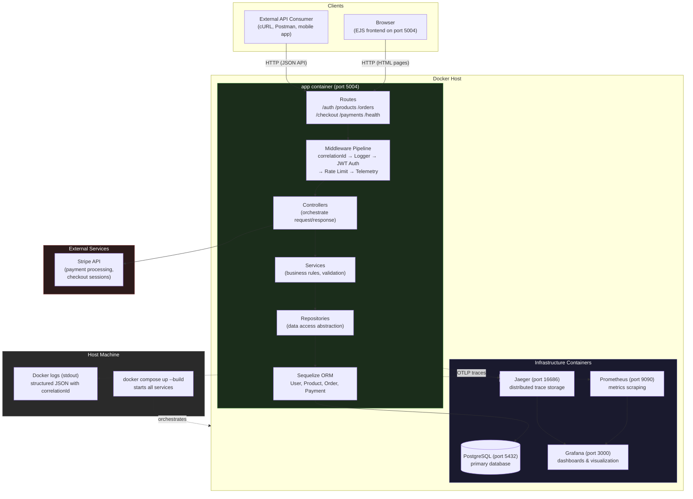

# E-Commerce Backend API (Production-Ready Portfolio Project)


A backend-focused e-commerce API that demonstrates more than CRUD: it is structured to showcase **operational excellence**, including **monitoring, observability, reliability patterns, secure defaults, and production-aware architecture**.

## Problem this solves

Building an e-commerce backend requires orchestrating multiple concerns: user authentication, product management, order processing, secure payment handling, and operational visibility. Most demo APIs stop at basic CRUD. This project demonstrates how to build a **production-grade backend** by addressing:

- **Secure transactions** — JWT authentication, admin role-based access control, rate-limited login, and server-side price enforcement on Stripe checkout prevent manipulation
- **Operational visibility** — structured logging with correlation IDs, Prometheus metrics, distributed tracing via OpenTelemetry/Jaeger, and pre-built Grafana dashboards give full insight into system behavior
- **Maintainable architecture** — layered separation (routes → controllers → services → repositories → models) keeps business logic decoupled from transport and data access
- **Reliability** — health probes, graceful shutdown, connection pooling, and CI/CD pipeline ensure the system can be deployed and operated confidently
- **Full payment flow** — end-to-end Stripe integration with secure server-side line item pricing so clients cannot tamper with prices

## System architecture



**Request flow:** Client → Middleware pipeline (correlation ID, logging, JWT verification, rate limiting, tracing) → Routes → Controllers → Services → Repositories → ORM → PostgreSQL. Observability data (metrics, traces, logs) emitted at every layer.

## Tech stack

| Category             | Technologies                                           |
| -------------------- | ------------------------------------------------------ |
| **Runtime**          | Node.js 20, Express 4                                  |
| **Database**         | PostgreSQL 15, Sequelize ORM 6                         |
| **Auth**             | JWT, bcryptjs, express-rate-limit                      |
| **Payments**         | Stripe API (checkout sessions)                         |
| **Observability**    | Prometheus, Grafana, OpenTelemetry, Jaeger             |
| **Frontend**         | EJS templates, vanilla JavaScript, CSS                 |
| **API Docs**         | Swagger UI (swagger-jsdoc)                             |
| **Testing**          | Jest, Supertest, jsdom                                 |
| **Containerization** | Docker, Docker Compose                                 |
| **CI/CD**            | GitHub Actions (lint + backend tests + frontend tests) |

## Running the application

### Option A: Full stack with Docker (recommended)

```bash
docker compose up --build
```

This starts all services defined in `docker-compose.yml`:

| Service        | Container    | Purpose                     | Local URL                |
| -------------- | ------------ | --------------------------- | ------------------------ |
| **App**        | `app`        | Express API + frontend      | {BASE_URL}:{APP_PORT}    |
| **Database**   | `postgres`   | PostgreSQL 15               | {BASE_URL}:{DB_PORT}     |
| **Metrics**    | `prometheus` | Scrapes /metrics every 15s  | {BASE_URL}:{PROM_PORT}   |
| **Dashboards** | `grafana`    | Pre-provisioned dashboards  | {BASE_URL}:{GRAF_PORT}   |
| **Tracing**    | `jaeger`     | OpenTelemetry trace storage | {BASE_URL}:{JAEGER_PORT} |

### Option B: Run API directly (without Docker)

Prerequisites: Node.js 20+, PostgreSQL running locally.

```bash
cp .env.example .env        # configure DB URL, JWT_SECRET, Stripe keys
npm ci                      # install dependencies
node server.js              # starts on {BASE_URL}:{APP_PORT}
```

### Option C: Development with live observability stack

Run the app locally but use Docker for the infrastructure:

```bash
# Start only PostgreSQL + Prometheus + Grafana + Jaeger
docker compose up postgres prometheus grafana jaeger

# In a separate terminal, start the app
node server.js
```

## API endpoints

| Method | Endpoint                   | Auth         | Description                                 |
| ------ | -------------------------- | ------------ | ------------------------------------------- |
| POST   | `/api/auth/register`       | None         | Register new user                           |
| POST   | `/api/auth/login`          | Rate-limited | Login, returns JWT                          |
| GET    | `/api/auth/profile`        | JWT          | User profile + recent orders                |
| POST   | `/api/auth/request-reset`  | None         | Request password reset                      |
| POST   | `/api/auth/reset-password` | None         | Reset password with token                   |
| GET    | `/api/products`            | None         | List all products                           |
| GET    | `/api/products/:id`        | None         | Get product by ID                           |
| POST   | `/api/products`            | Admin        | Create product                              |
| PUT    | `/api/products/:id`        | Admin        | Update product                              |
| DELETE | `/api/products/:id`        | Admin        | Delete product                              |
| GET    | `/api/products/search`     | None         | Search products by name                     |
| GET    | `/api/orders`              | JWT          | List orders (user sees own, admin sees all) |
| POST   | `/api/orders`              | JWT          | Create order                                |
| GET    | `/api/orders/:id`          | JWT          | Get order (with ownership check)            |
| PUT    | `/api/orders/:id`          | JWT          | Update order (admin can update status)      |
| DELETE | `/api/orders/:id`          | JWT          | Delete order (with ownership check)         |
| POST   | `/api/checkout`            | JWT          | Create Stripe checkout session              |
| GET    | `/api/payments`            | JWT          | List payments                               |
| POST   | `/api/payments`            | JWT          | Create payment record                       |
| GET    | `/api/payments/:id`        | JWT          | Get payment by ID                           |
| GET    | `/health/live`             | None         | Liveness probe (process uptime)             |
| GET    | `/health/ready`            | None         | Readiness probe (DB connectivity)           |
| GET    | `/metrics`                 | None         | Prometheus metrics endpoint                 |
| GET    | `/api-docs`                | None         | Swagger UI documentation                    |

## Containerization

The project uses **Docker Compose** to orchestrate 5 containers:

```yaml
services:
  app: # Node.js 20 (non-root user), serves API + frontend on port 5004
  postgres: # PostgreSQL 15, persistent volume, health check
  prometheus: # Scrapes app:/metrics every 15s, persistent volume
  grafana: # Pre-provisioned datasources + dashboards, persistent volume
  jaeger: # OpenTelemetry trace ingestion + UI, in-memory storage
```

- **Dockerfile** uses multi-stage build: `npm ci` in build stage, then copies only production dependencies to a clean `node:20-alpine` image running as a non-root `nodeuser`
- **Health check** configured for `postgres` so the app waits for the database to be ready
- **Volumes** persist PostgreSQL data, Prometheus data, and Grafana provisioning/config across restarts
- **Dependency order**: `app depends_on: postgres`, `prometheus` and `grafana` start independently

## Monitoring and observability

### 1) Structured logging

Every request is logged as JSON with timestamp, level, method, path, status, duration, and `correlationId`.

### 2) Correlation IDs

`x-correlation-id` is accepted or generated per request and returned in responses, enabling cross-referencing across logs, metrics, and traces.

### 3) Metrics (Prometheus)

Available at `GET /metrics`:

- `http_request_duration_seconds` (histogram)
- `http_requests_total` (counter)
- `http_in_flight_requests` (gauge)
- `api_errors_total` (counter)
- Default Node.js process/runtime metrics

### 4) Tracing (OpenTelemetry)

Auto-instrumentation for Express and PostgreSQL exports traces to Jaeger via OTLP.

### 5) Dashboards

Grafana is pre-provisioned with dashboards under `grafana/provisioning/dashboards/`. Prometheus scrape config at `prometheus/prometheus.yml`.

## Production readiness

### Implemented

| Category       | Items                                                              |
| -------------- | ------------------------------------------------------------------ |
| Config         | Environment-based config with required variable validation         |
| Error handling | Centralized handler with consistent JSON error envelopes           |
| Reliability    | Graceful shutdown (SIGINT/SIGTERM) — HTTP server, DB pool, tracer  |
| Security       | JWT auth, bcrypt passwords, admin RBAC, rate-limited login         |
| CI/CD          | GitHub Actions (lint + backend tests + frontend tests in parallel) |
| Container      | Docker, Docker Compose, non-root runtime user, health checks       |

### Recommended before production

See [`docs/PENDING_IMPROVEMENTS.md`](docs/PENDING_IMPROVEMENTS.md) for the full prioritized checklist. Key items:

- Database migrations (replace `sequelize.sync`)
- Input validation library (Zod/Joi)
- Security headers (Helmet)
- HTTP-only cookies for JWT

## Suggested portfolio talking points

When presenting this project, emphasize:

- "I built observability in from day one (logs, metrics, traces) rather than adding it after incidents."
- "I designed health probes and graceful shutdown to support container orchestration and zero-downtime deployments."
- "I separated business logic from transport and data access concerns for maintainability and scale."
- "I identified and documented 20+ technical improvements with prioritization — the same approach I'd use onboarding to a production system."

## Pending improvements

Tracked in detail at [`docs/PENDING_IMPROVEMENTS.md`](docs/PENDING_IMPROVEMENTS.md) — includes security hardening, architectural consistency, production readiness, and testing gaps with a phase-based scoring system.

## Future improvements

### Performance & scaling

- **Redis caching** — cache product listings and search results to reduce DB load and improve response times
- **Database read replicas** — separate read/write traffic for horizontal scaling under load
- **Connection pooling tuning** — environment-aware pool sizing for PostgreSQL

### Reliability & resilience

- **Idempotency keys** — prevent duplicate checkout/payment submissions on network retries
- **Outbox pattern + message broker** (Kafka/SQS) — reliable order event processing and async fulfillment workflows
- **Retry with exponential backoff** — for Stripe API calls and external service integrations
- **Circuit breaker** — protect downstream dependencies from cascading failures

### Security

- **Rate limiting on all endpoints** — general API abuse protection beyond just login
- **Refresh token rotation** — short-lived access tokens + long-lived refresh tokens with rotation
- **Secrets manager integration** (AWS Secrets Manager / Vault) — no secrets in environment variables
- **TLS termination** — enforce HTTPS at reverse proxy layer

### Testing & quality

- **Contract tests** — validate API responses against OpenAPI spec (Pact or Dredd)
- **Load testing CI stage** — automated k6/artillery tests as a gating step
- **Fuzz testing** — edge case discovery for input validation
- **Mutation testing** — measure test suite effectiveness

### Observability maturity

- **SLO dashboards** — track latency, error rate, and throughput against defined targets
- **Alert rules** — Prometheus alerting for p99 latency spikes, elevated 5xx rates, DB connectivity loss
- **Business metrics** — orders created, revenue processed, products sold as Prometheus counters
- **Log correlation runbooks** — documented workflows for tracing issues using `correlationId`

### Platform & DevOps

- **Kubernetes deployment manifests** — Helm charts or Kustomize for production orchestration
- **Blue-green deployments** — zero-downtime release strategy
- **Feature flags** — gradual rollouts and A/B testing capability
- **Database migration pipeline** — automated migrations as part of CI/CD with rollback support
