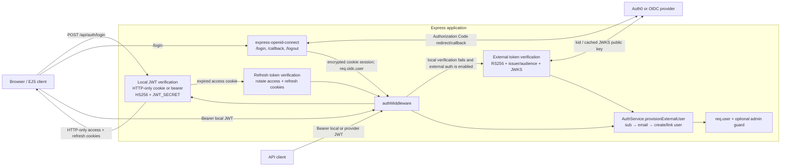

# Architecture Overview

## Layers

1. **Routing Layer** (`routes/`): HTTP route definitions and endpoint grouping.
2. **Controller Layer** (`controllers/`): request/response orchestration.
3. **Service Layer** (`services/`): business rules and validation logic.
4. **Repository Layer** (`repositories/`): data-access abstractions over Sequelize models.
5. **Infrastructure Layer** (`config/`, `middleware/`, `utils/`): configuration, telemetry, logging, metrics, error handling.

## Layered Domains

| Domain   | Route file                | Controller                         | Service                      | Repository                          |
| -------- | ------------------------- | ---------------------------------- | ---------------------------- | ----------------------------------- |
| Auth     | `routes/authRoutes.js`    | `controllers/authController.js`    | `services/authService.js`    | `repositories/authRepository.js`    |
| Orders   | `routes/orderRoutes.js`   | `controllers/orderController.js`   | `services/orderService.js`   | `repositories/orderRepository.js`   |
| Payments | `routes/paymentRoutes.js` | `controllers/paymentController.js` | `services/paymentService.js` | `repositories/paymentRepository.js` |
| Products | `routes/productRoutes.js` | `controllers/productController.js` | `services/productService.js` | `repositories/productRepository.js` |

Controllers use `utils/asyncHandler.js` so thrown service errors flow into the shared error middleware. Services throw `HttpError` for expected validation, authorization, and not-found cases.

## Authentication Architecture

Protected requests are resolved in this order:

1. An authenticated `express-openid-connect` cookie session.
2. A local HS256 access JWT from an HTTP-only cookie.
3. A local HS256 bearer JWT for non-browser API clients.
4. An external RS256 bearer JWT validated against the configured issuer, audience, and JWKS endpoint.

The OIDC browser flow and local JWT flow are separate. The browser middleware owns the authorization redirect, callback validation, token exchange, encrypted OIDC cookie session, and `/logout` route. Local login issues access and refresh JWT cookies; an expired access cookie can be renewed by `tryAutoRefresh()`, and `/api/auth/refresh` exposes explicit rotation. External provider bearer tokens are only verified and are not refreshed by this application.

The local frontend relies on HTTP-only cookies and does not read tokens from JavaScript. The API currently also includes access and refresh tokens in login/refresh JSON responses, which weakens that boundary and should be removed for browser clients.

## Reliability and Observability Path

- Every request receives a `x-correlation-id` and is logged in structured JSON.
- Metrics are exposed at `/metrics` in Prometheus format.
- OpenTelemetry traces are exported to Jaeger via OTLP.
- Health checks:
  - `/health/live`: process liveness
  - `/health/ready`: database readiness
- Graceful shutdown handles `SIGINT`/`SIGTERM` and closes HTTP server, DB pool, and tracer.

## Deployment Topology (docker-compose)

- `app` (Node.js API)
- `postgres` (database)
- `prometheus` (metrics scraping)
- `grafana` (dashboards)
- `jaeger` (trace storage and UI)
